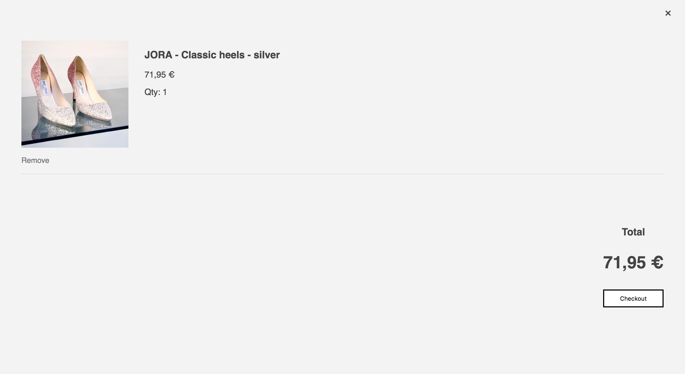

# Shopping cart

Let's create a shop application.

Display a list of products. You can use the json in the exercise folder, or you can add your own products.
Each product should display an image, a price and a button that allows the user to add it to their bag.

When the product is sold out there should be a badge indicating this, and the button to add to bag should be disabled.

Whenever the cart is empty, there is a message to notify the user the cart is empty:

When the user has added items, they can be displayed in the cart with the right amounts and total amount displayed.

The total amount of items in the cart are also dispayed in the site header.

For each item in the cart there is a remove, that removes a quantity of one.

On checkout the items are 'bought' - they are removed from the product inventory.

Extra:

- Add a note whenever items left are only few.